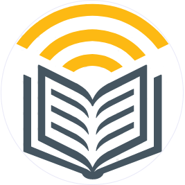

<h3 align="center"></h3>

# :pen: Handwriting Reader :sound: 
A simple web app that aims to make an audiobook out of the given pictures of text. Often time reading through several pages can be stressful. So I am introducing a web app that will scan through the pages and read it out for us. This feature could be quite handy for partially blind people to help them read. Azure computer vision OCR was used to recognise the text. Then azure cognitive text to speech service is used to get the audio output. This project was made as a part of Future Ready Talent Program at Microsoft.
<!-- insert gif -->

## Tech Stack
Backend:
- [Node.js](https://nodejs.org/)
- [Express](https://expressjs.com/)
- [Azure computer vision](https://azure.microsoft.com/en-us/services/cognitive-services/computer-vision/)
- [Azure text to speech](https://azure.microsoft.com/en-us/services/cognitive-services/text-to-speech/)

Frontend:
- [Vanilla JavaScript](https://vanilla-js.com/)
- [HTML5](https://www.w3schools.com/html/html5_intro.asp)
- [CSS3](https://www.w3schools.com/css/css3_intro.asp)

Deployment:
- [Microsoft Azure Virtual Machines](https://azure.microsoft.com/en-us/services/virtual-machines/)
- [Nginx](https://www.nginx.com/)
- [PM2](https://pm2.io/)
- [Certbot](https://certbot.eff.org/)

#### Created by Mitrajit Chandra Chandra as a part of Future Ready Talent internship project.